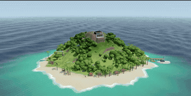

# Lyftide

A 3D island world built as an experiment.

The name blends *lyf* (life, old English) with *tide* — life moving with the tide,
unhurried and steady.



## What it is

A browser-based 3D scene of a lush, self-sufficient island: a house on the summit,
stone paths winding down to a sandy beach, a dock with two ships, farms fed by a
freshwater stream, and wildlife roaming the forest. A 20-minute day/night cycle
drives the world — sunrise, noon, sunset, stars — all synced to the real clock.

Three features, one loop: **Homeland → Sail out → Fish → Come back.**

## Stack

- React 19 + TypeScript
- Three.js (r185) + React Three Fiber
- TanStack Router (file-based)
- Tailwind v4 + shadcn/ui (not use yet!)
- Vite

## Running

```bash
npm install
npm run dev
```

Open [localhost:3000](http://localhost:3000).
